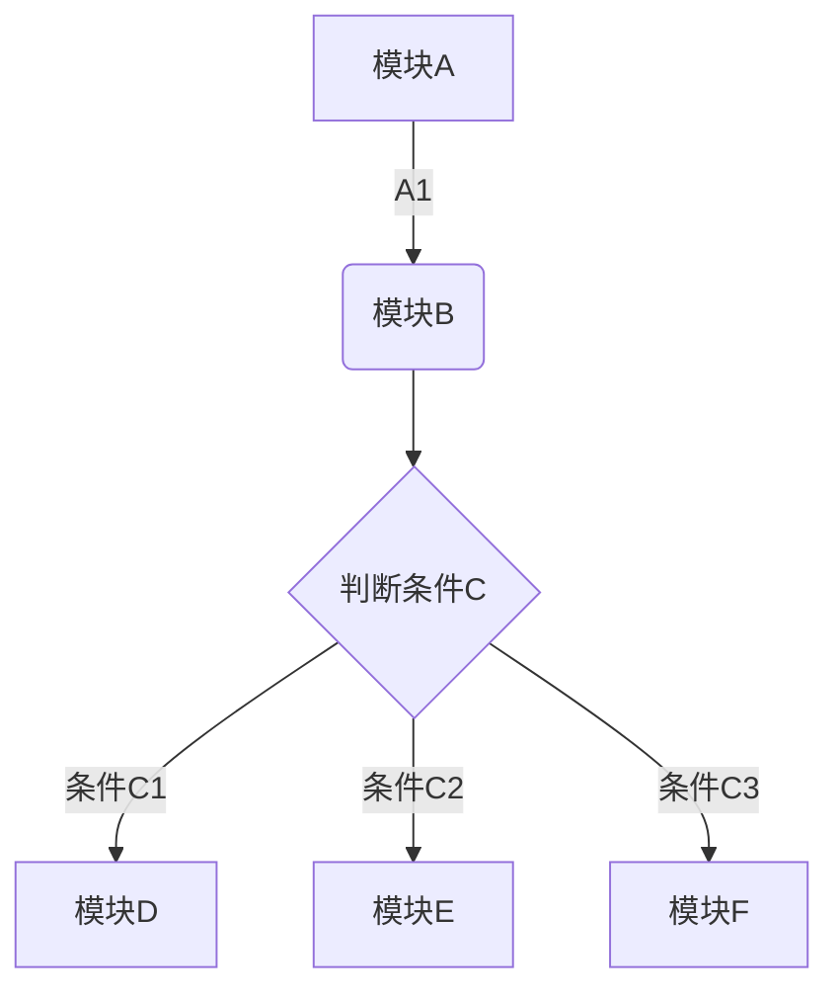
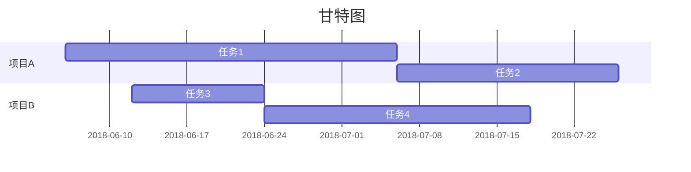

[学习印象md](
https://list.yinxiang.com/markdown/eef42447-db3f-48ee-827b-1bb34c03eb83.php)

# d
## d
### 测试
#### *测*

***

**阿斯蒂芬**

>saddddddddddddddddd

~~<u>sdf</u>~~

* asdf


* [x] asdf
* [ ] asdf

[百度](www.baidu.com)


| 1 | 2 | 3 | 4 |
| --- | --- | --- | --- |
| 5 | 6 | 7 | 8 |


```chart
,预算,收入,花费,债务
June,5000,8000,4000,6000
July,3000,1000,4000,3000
Aug,5000,7000,6000,3000
Sep,7000,2000,3000,1000
Oct,6000,5000,4000,2000
Nov,4000,3000,5000,


type: bar
title: 每月收益
x.title: Amount
y.title: Month
y.suffix: $
```


``` java
import java.lang.asdf
line = "Cats are smarter than dogs"
matchObj = re.match( r'(.*) are (.*?) .*', line, re.M|re.I)
if matchObj:
    print "matchObj.group() : ", matchObj.group()
    print "matchObj.group(1) : ", matchObj.group(1)
    print "matchObj.group(2) : ", matchObj.group(2)
else:
    print "No match!!"
```








[TOC]


**qew**f<u>ad</u>

* * *


```
efwef
```

2019/11/30 17:37

* [ ] sda